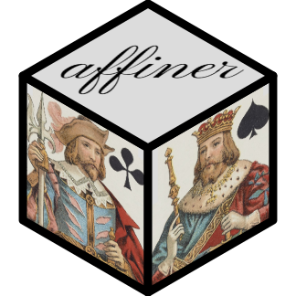

# affiner 

[](https://cran.r-project.org/package=affiner)
[](https://github.com/trevorld/affiner/actions)
[](https://app.codecov.io/gh/trevorld/affiner)
[](https://www.repostatus.org/#wip)

*I have not heard of a finer package* --Typical R developer when asked what they have heard about `{affiner}`.

### Table of Contents

* [Overview](#overview)
* [Installation](#installation)
* [Examples](#examples)

  + [Isometric-cube hex logo](#logo)
  + [Render an "illustrated" d6 dice using oblique and isometric projections](#dice)

* [Related software](#related)

## <a name="overview">Overview</a>

**Warning:** this package is a work-in-progress.  Any implemented functions are tested and will probably work well but the API is incomplete and liable to experience sudden breaking changes.

`{affiner}` plans to be an extraction and improvement of the low-level geometric and R 4.2 affine transformation feature functionality used in [{piecepackr}](https://github.com/trevorld/piecepackr/) to render board game pieces in `{grid}` using a 3D oblique projection.


The current goals are to:

1. Make it easier for `{piecepackr}` users to use this low-level geometric functionality without exporting it in `{piecepackr}` (which already has a large API) in case they want to do things like implement custom polyhedral dice.
2. Make it easier for other R developers to support fancier 3D renderings in their packages using `{grid}` (and perhaps `{ggplot2}`).
3. Refactor and improve this code base.

Some particular intended strengths compared to other R geometry packages:

1. Focus on reducing pain points in rendering "illustrated" (game) pieces in a 3D parallel projections in `{grid}` (e.g. oblique projections and isometric projections).
2. Helpers for using the R 4.2 affine transformation feature to render "illustrated" 3D faces in `{grid}`.
   The `affine_settings()` function which reverse engineers `useGrob()`'s `vp` and `transformation` arguments
   is even available as a "standalone" file that can be copied
   over into other R packages under the permissive [Unlicense](https://unlicense.org/).
3. Functions to convert between [axis-angle representation](https://en.wikipedia.org/wiki/Axis%E2%80%93angle_representation) and [rotation matrix](https://en.wikipedia.org/wiki/Rotation_matrix).
4. Allows users to use whichever angular unit is most convenient for them including degrees, radians, turns, half-turns aka (multiples-of-)pi-radians, and gradians.
5. Light dependencies: only non-base R package dependency is [{R6}](https://github.com/r-lib/R6/) which is a pure R package with no other dependencies.

## <a name="installation">Installation</a>

```{r install, eval = FALSE}
remotes::install_github("trevorld/affiner")
```

## <a name="examples">Examples</a>

```{r hidden, echo = FALSE}
knitr::opts_chunk$set(fig.path = "man/figures/README-", fig.cap = "")
```

### <a name="logo">Isometric-cube hex logo</a>

* The three visible faces of an isometrically projected cube are parallelograms.  Additionally each projected vertex will match one of the six vertices of a regular hexagon or its center.
* The `as_coord2d()` method for `angle()` objects lets you compute the regular polygon vertices and center using [polar coordinates](https://en.wikipedia.org/wiki/Polar_coordinate_system)
* Use `affine_settings()` and `affineGrob()`  or `grid.affine()` to render arbitrary "illustrated" grobs within each of these parallelograms.

```{r hex-logo, fig.width = 4.5, fig.height = 4.5}
library("affiner")
library("grid")

xy <- as_coord2d(angle(seq(90, 360 + 90, by = 60), "degrees"),
                 radius = c(rep(0.488, 6), 0))
xy$translate(coord2d(x = 0.5, y = 0.5))
l_xy <- list()
l_xy$left <- xy[c(2, 3, 4, 7)]
l_xy$right <- xy[c(7, 4, 5, 6)]
l_xy$top <- xy[c(1, 2, 7, 6)]

gp_border <- gpar(fill = NA, col = "black", lwd = 12)
vp_define <- viewport(width = unit(3, "inches"), height = unit(3, "inches"))

colors <- c("#D55E00", "#009E73", "#56B4E9")
spacings <- c(0.25, 0.2, 0.25)
texts <- c("pkgname", "left\nface", "right\nface")
rots <- c(45, 0, 0)
fontsizes <- c(52, 80, 80)
sides <- c("top", "left", "right")
types <- gridpattern::names_polygon_tiling[c(5, 7, 9)]
grid.newpage()
for (i in 1:3) {
    xy_side <- l_xy[[sides[i]]]
    if (requireNamespace("gridpattern", quietly = TRUE)) {
        bg <- gridpattern::grid.pattern_polygon_tiling(
                   colour = "grey80",
                   fill = c(colors[i], "white"),
                   type = types[i],
                   spacing = spacings[i],
                   draw = FALSE)
    } else {
        bg <- rectGrob(gp = gpar(col = NA, fill = colors[i]))
    }
    text <- textGrob(texts[i], rot = rots[i],
                     gp = gpar(fontsize = fontsizes[i]))
    settings <- affine_settings(xy_side, unit = "snpc")
    grob <- grobTree(bg, text)
    grid.affine(grob,
                vp_define = vp_define,
                transform = settings$transform,
                vp_use = settings$vp)
    grid.polygon(xy_side$x, xy_side$y, gp = gp_border)
}
```


### <a name="dice">Render an "illustrated" d6 dice using oblique and isometric projections</a>

Our high-level strategy for rendering 3D objects is as follows:

* Figure out the "physical" 3D coordinates of the cube face vertices in "inches".  These cube faces will correspond to target "3D viewports" we'll want to render the illustrated cube face grobs into.

  + For my piecepack diagrams I make with [{piecepackr}](https://github.com/trevorld/piecepackr/) I figuratively think as my graphics device as a piece of paper (bottom left corner is the origin)  and calculate the 3D coordinates in inches as if my board game pieces were physically sitting on top of the graphics device (since piecepack tiles are 2 inches by 2 inches this is usually a straightforward calculation).
  
* Project these 3D coordinates onto a "physical" xy-plane (corresponding to our graphics device) in "inches" using a parallel projection (in this example we'll do a couple oblique projections and an isometric projection).  Note since all parallel projections are affine transformations we know the projected vertices of a square "3D viewport" will project to the 2D coordinates of a "parallelogram viewport".
* (If they don't already do so) translate these parallelograms so they lie within the graphics device view (i.e. the "parallelogram viewport" vertices are all in the upper right quadrant of the xy-plane).

  + If you use an oblique projection to the xy-plane with an `alpha` angle between 0 and 90 degrees then any flat faces lying directly on the xy-plane will stay where they are and any flat faces on a parallel higher plane will only be shifted up/right.  So in this case one usually doesn't need to such a translation assuming all your "objects" were placed in the upper quadrant of the xy-plane to begin with.

* Use `affine_settings()` and `grid.affine()` / `affineGrob()` to render the illustrated cube face "grobs" within these affine transformed "parallelogram viewports".  The order these are drawn is important but in this example we manually sorted them ahead of time in an order that worked for our target projections.

```{r die-faces, fig.width = 4.0, fig.height = 3.0}
library("affiner")
library("grid")
xyz_face <- coord3d(x = c(0, 0, 1, 1) - 0.5, y = c(1, 0, 0, 1) - 0.5, z = 0.5)
l_faces <- list() # order faces for our target projections
l_faces$bottom <- xyz_face$clone()$
                    rotate("z-axis", angle(180, "degrees"))$
                    rotate("y-axis", angle(180, "degrees"))
l_faces$north <- xyz_face$clone()$
                    rotate("z-axis", angle(90, "degrees"))$
                    rotate("x-axis", angle(-90, "degrees"))
l_faces$east <- xyz_face$clone()$
                    rotate("z-axis", angle(90, "degrees"))$
                    rotate("y-axis", angle(90, "degrees"))
l_faces$west <- xyz_face$clone()$
                    rotate("y-axis", angle(-90, "degrees"))
l_faces$south <- xyz_face$clone()$
                    rotate("z-axis", angle(180, "degrees"))$
                    rotate("x-axis", angle(90, "degrees"))
l_faces$top <- xyz_face$clone()$
                    rotate("z-axis", angle(-90, "degrees"))

colors <- c("#D55E00", "#009E73", "#56B4E9", "#E69F00", "#CC79A7", "#0072B2")
spacings <- c(0.25, 0.2, 0.25, 0.25, 0.25, 0.25)
die_face_grob <- function(digit) {
    if (requireNamespace("gridpattern", quietly = TRUE)) {
        bg <- gridpattern::grid.pattern_polygon_tiling(
                   colour = "grey80",
                   fill = c(colors[digit], "white"),
                   type = gridpattern::names_polygon_tiling[digit],
                   spacing = spacings[digit],
                   draw = FALSE)
    } else {
        bg <- rectGrob(gp = gpar(col = NA, fill = colors[digit]))
    }
    digit <- textGrob(digit, gp = gpar(fontsize = 72))
    grobTree(bg, digit)
}
l_face_grobs <- lapply(1:6, function(i) die_face_grob(i))
grid.newpage()
for (i in 1:6) {
    vp <- viewport(x = unit((i - 1) %% 3 + 1, "inches"),
                   y = unit(3 - ((i - 1) %/% 3 + 1), "inches"),
                   width = unit(1, "inches"), height = unit(1, "inches"))
    pushViewport(vp)
    grid.draw(l_face_grobs[[i]])
    popViewport()
    grid.text("The six die faces", y = 0.9, 
              gp = gpar(fontsize = 18, face = "bold"))
}
```
```{r projected-die, fig.width = 3.0, fig.height = 3.0}
# re-order face grobs for our target projections
# bottom = 6, north = 4, east = 5, west = 2, south = 3, top = 1
l_face_grobs <- l_face_grobs[c(6, 4, 5, 2, 3, 1)]
draw_die <- function(l_xy, l_face_grobs) {
    min_x <- min(vapply(l_xy, function(x) min(x$x), numeric(1)))
    min_y <- min(vapply(l_xy, function(x) min(x$y), numeric(1)))
    l_xy <- lapply(l_xy, function(xy) {
        xy$translate(coord2d(-min_x + 0.5, -min_y + 0.5))
    })
    grid.newpage()
    vp_define <- viewport(width = unit(1, "inches"), height = unit(1, "inches"))
    gp_border <- gpar(col = "black", lwd = 4, fill = NA)
    for (i in 1:6) {
        xy <- l_xy[[i]]
        settings <- affine_settings(xy, unit = "inches")
        grid.affine(l_face_grobs[[i]],
                    vp_define = vp_define,
                    transform = settings$transform,
                    vp_use = settings$vp)
        grid.polygon(xy$x, xy$y, default.units = "inches", gp = gp_border)
    }
}
# oblique projection of dice onto xy-plane
l_xy_oblique1 <- lapply(l_faces, function(xyz) {
    xyz$clone() |>
        as_coord2d(scale = 0.5)
})
draw_die(l_xy_oblique1, l_face_grobs)
grid.text("Oblique projection\n(onto xy-plane)", y = 0.9,
          gp = gpar(fontsize = 18, face = "bold"))

# oblique projection of dice on xz-plane
l_xy_oblique2 <- lapply(l_faces, function(xyz) {
    xyz$clone()$
        permute("xzy") |>
        as_coord2d(scale = 0.5, alpha = angle(135, "degrees"))
})
draw_die(l_xy_oblique2, l_face_grobs)
grid.text("Oblique projection\n(onto xz-plane)", y = 0.9,
          gp = gpar(fontsize = 18, face = "bold"))

# isometric projection
l_xy_isometric <- lapply(l_faces, function(xyz) {
    xyz$clone()$
        rotate("z-axis", angle(45, "degrees"))$
        rotate("x-axis", angle(-(90 - 35.264), "degrees")) |>
        as_coord2d()
})

draw_die(l_xy_isometric, l_face_grobs)
grid.text("Isometric projection", y = 0.9,
          gp = gpar(fontsize = 18, face = "bold"))
```

## <a name="related">Related software</a>

Please feel free to [open a pull request to add any missing relevant links](https://github.com/trevorld/affiner/edit/main/README.Rmd).

### <a name="related-geometry">Geometry in R</a>

#### <a name="spatial">2D/3D geometry</a>

* [{euclid}](https://github.com/thomasp85/euclid) and [{polyclid}](https://polyclid.r-euclid.com/)
* [{geometry}](https://davidcsterratt.github.io/geometry/)

#### <a name="plane">Plane geometry</a>

* [LearnGeom](https://cran.r-project.org/web/packages/LearnGeom/index.html)
* [PlaneGeometry](https://cran.r-project.org/web/packages/PlaneGeometry/index.html)

#### <a name="spatial">Spatial geometry</a>

* [{sf}](https://cran.r-project.org/web/views/Spatial.html)
* [{terra}](https://rspatial.org/index.html)
* See [CRAN Task View: Analysis of Spatial Data](https://cran.r-project.org/web/views/Spatial.html)

### <a name="related-rendering">3D rendering in R</a>

#### <a name="related-grid">`{graphics}` and `{grid}` based</a>

* [{isocubes}](https://github.com/coolbutuseless/isocubes), [{isocuboids}](https://github.com/cj-holmes/isocuboids), 
  and [{oblicubes}](https://github.com/trevorld/oblicubes) supports 3D rendering of cubes and cuboids.
* [{lattice}](https://lattice.r-forge.r-project.org/)
* [{misc3d}](https://cran.r-project.org/web/packages/misc3d/index.html) and [{plot3D}](https://cran.r-project.org/package=plot3D)
* [{piecepackr}](https://github.com/piecepackr/piecepackr) supports 3D rendering using an oblique projection (as well as other projections).  Specializes in the production of board game graphics.  Much of the functionality of `{affiner}` is a refined extraction from `{piecepackr}`.
* [{scatterplot3d}](https://cran.r-project.org/package=scatterplot3d)
* [{threed}](https://github.com/coolbutuseless/threed) and [{ggthreed}](https://github.com/coolbutuseless/ggthreed)

#### <a name="related-other">Other 3D rendering engines</a>

* [{rdog}](https://github.com/oganm/rdog) and [{minizdog}](https://github.com/coolbutuseless/minizdog)
* [{rgl}](https://dmurdoch.github.io/rgl/)
* [{rayrender}](https://www.rayrender.net/)
* [{rayvertex}](https://www.rayvertex.com/)
